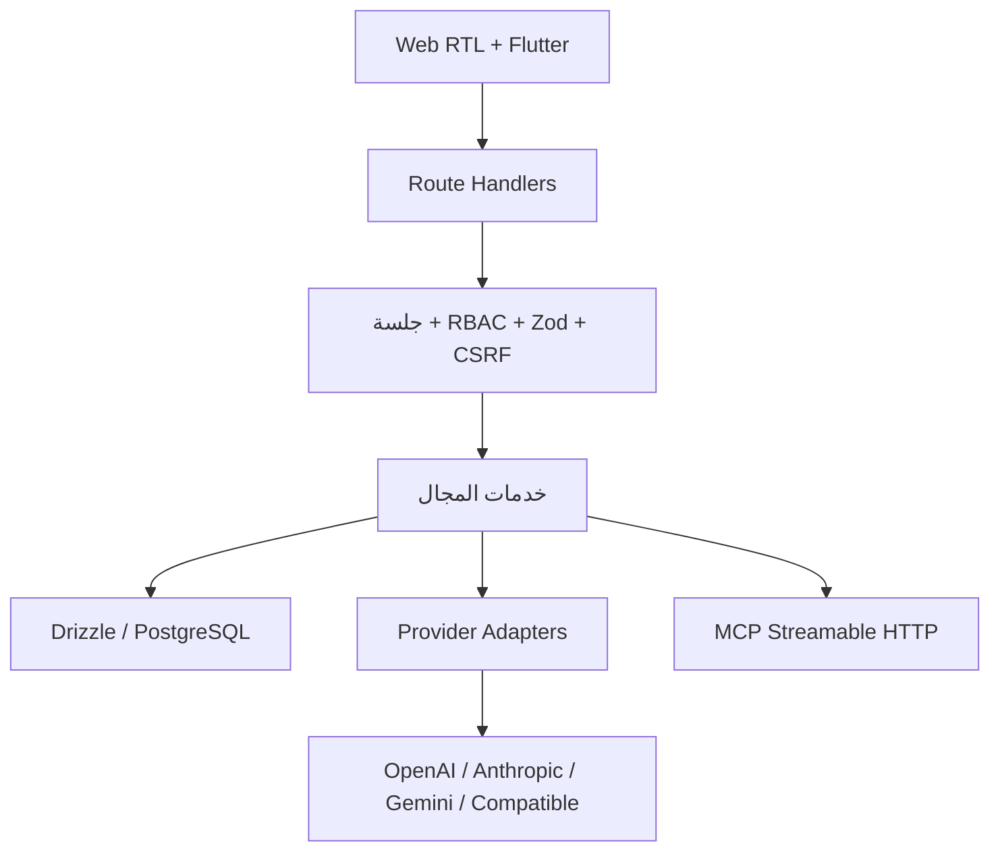

# المعمارية

## توسعة منصة الوكلاء

تبقى خدمات المزودات والتشغيل الحالية مصدر الحقيقة. يضيف `src/ai/runtime` عقدًا محايدًا، ولا يعرض `src/ai/tools` إلا الأدوات المسجلة في قائمة السماح. الأدوات عالية الخطورة تحتاج موافقة محفوظة ومنتهية الصلاحية وسجل تدقيق.

يتبع RAG المسار: مرفق متحقق → وثيقة → مهمة `document.parse` → مقاطع محدودة → استرجاع مع citations. الاسترجاع النصي في PostgreSQL هو الافتراضي ويمكن إضافة pgvector خلف Adapter دون جعله شرطًا.

يدّعي Worker الأعمال ذريًا عبر `FOR UPDATE SKIP LOCKED` مع استرداد locks وحد محاولات وbackoff. لا يبدأ Web أي loop للعامل.

## الحدود العامة

التطبيق خدمة Next.js واحدة حتى لا تُضاف بنية موزعة غير مستخدمة. المسارات والواجهات في `src/app`، منطق المجال في `src/lib`، ومخطط PostgreSQL في `src/db/schema.ts`.

## الطبقات

- Route Handlers: request ID، المصادقة، permission، CSRF، rate limit، parsing وحدود body، وتحويل النتيجة إلى عقد API موحد.
- خدمات المجال: الوكلاء والإصدارات، المحادثة، تجهيز سياق النموذج، دورة التشغيل، الإلغاء، الأحداث والتدقيق.
- Provider Adapters: `discoverModels`, `testModel`, `generate`, `stream`, `normalizeError`, `normalizeUsage`, `abort` والقدرات.
- طبقة البيانات: Drizzle مع قيود وفهارس وعلاقات، وكل استعلام tenant-owned مقيد بالمؤسسة المشتقة من الجلسة أو API key.

## المصادقة والمؤسسة النشطة

قاعدة البيانات تخزن hash لجلسة عشوائية، بينما Cookie تحمل القيمة الأصلية كـ`HttpOnly`. كل جلسة تخزن `activeOrganizationId`. عند عضوية واحدة يمكن اختيارها حتميًا؛ عند عدة عضويات يختار المستخدم صراحة ولا تُستخدم أول عضوية عشوائيًا.

## الوكلاء والإصدارات

سجل `agents` يحتفظ بالحالة ورقم الإصدار الحالي. كل تغيير في إعدادات Runtime أو نشر جديد ينشئ صفًا جديدًا ثابتًا في `agent_versions`. التشغيل يقبل الوكلاء المنشورين فقط ويتحقق من أن المزود مفعّل ونجح آخر فحص.

## المحادثة والتشغيل

رسالة المستخدم تُحفظ أولًا. يبنى السياق من الرسائل الأخيرة بميزانية تقديرية ويضاف system instruction على الخادم فقط. ينشأ Run في `queued` ثم `running`. أحداث مهمة فقط تُحفظ؛ لا يكتب كل token إلى قاعدة البيانات. بعد اكتمال البث تُحفظ رسالة المساعد والـusage والنتيجة داخل transaction.

## فرق الوكلاء

يحمل `agent_teams` وكيلًا مشرفًا وأعضاء ذوي أدوار واضحة. عند التشغيل تُنشأ
محادثة وتشغيل مستقلان لكل عامل وتنفذ الأعمال بعدد توازٍ محدود. بعد نجاح العمال
يتلقى المشرف المدخل الأصلي والنواتج الموسومة ويولف الرد النهائي. تخزن
`agent_team_runs` الحالة والنتيجة، وتخزن `agent_team_run_steps` كل خطوة ومدتها
ومعرف Run الأساسي.

## بوابة MCP

يتصل `src/ai/mcp/client.ts` بخوادم MCP البعيدة عبر Streamable HTTP باستخدام
SDK الرسمي. يطبق عنوان الخادم فحص SSRF نفسه المستخدم للمزودات المخصصة. تحفظ
عملية الاكتشاف اسم الأداة ووصفها وJSON Schema وبصمة التغيير، بينما يسجل كل
استدعاء مدخلاته ونتيجته ومدته وخطئه. لا تُمنح أداة تلقائيًا لأي وكيل؛ الربط
والسماح الصريح محفوظان في `agent_mcp_tools`.

## تطبيق Flutter

`apps/mobile` عميل أصلي مستقل بصريًا عن DOM الموقع. يتصل بـREST، يحفظ الرموز
في Android Keystore، ويدور Refresh Token عند أول 401. كل استعلام هاتف مقيد
بعضوية المستخدم؛ المحادثات والتشغيل لا تعيد بيانات مستخدم آخر في المؤسسة.

## الاعتمادية

- اتصالات المزودات بدون cache أو redirects.
- DNS validation قبل كل اتصال لتقليل DNS rebinding.
- timeout وحد أقصى لحجم JSON والبث.
- retry محدود فقط لـ408/429/5xx والأخطاء الشبكية.
- circuit cooldown بعد إخفاقات متتالية.
- Pagination للقوائم المتنامية.
- لا اتصال بقاعدة البيانات ولا migration أثناء `next build`.

## Runtime

المصادقة والتشفير وDNS والمزودات تعمل على Node runtime. لا تدعي المسارات التي تستخدم `node:crypto` و`node:dns` أنها Edge-native. Docker/Railway هو مسار النشر الأساسي.
